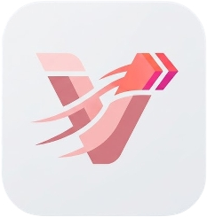

<div align="center">
  
  <h1>velo</h1>
</div>

A fast, plugin-extensible launcher for Wayland, combining [tofi](https://github.com/philj56/tofi)'s speed with rofi's extensibility through TOML.

No compiled modes, no scripts, no C plugins. Everything is a TOML file.

## Features

- **TOML plugin system**: all functionality is a plugin: app launcher, calculator, AI chat, tmux manager, WiFi connector, and more
- **5 plugin types**: `list` (menus), `select` (dynamic lists), `input` (text prompts), `feedback` (interactive loops), `exec` (immediate actions)
- **Stack-based navigation**: arbitrary nesting depth, ESC always pops one level
- **Dictionary flow**: values accumulate through the nav stack via `{key}` template substitution
- **Plugin chaining**: `next` forwards to another plugin, `return` passes values back to parent
- **Teleport**: type `calc:`, `tmux:`, `url:` to jump directly to any plugin
- **Autosize**: dynamic window height that grows/shrinks to fit results (like macOS Spotlight)
- **Palettes**: 60+ dark/light color palettes (noctalia-compatible JSON), `palette = "name"` + `darkmode`, `--list-palettes` to list
- **Pipe modes**: `--pick` (dmenu replacement), `--input` (zenity --entry), `--sensitive` (passwords)
- **Fuzzy search**: results sorted by match quality (contiguous > spread out)
- **Dependency checking**: plugins auto-hide if required binaries are missing
- **Fast**: inherits tofi's performance (~2-6ms startup)

## Bundled Plugins

| Plugin | Type | Description |
|--------|------|-------------|
| **drun** | select | Desktop application launcher |
| **url** | input | Open URLs with xdg-open |
| **calculator** | feedback | Calculator via qalc with persistent history |
| **opencode** | feedback | AI chat via opencode |
| **tmux** | list | Session manager: attach, close, new, freeze, unfreeze |
| **hyprland** | list | Window focus, workspace switching |
| **wifi** | list | Connect, reconnect, forget networks |
| **theme** | list | Switch the velo palette and kitty/waybar/hyprland themes |
| **enter-password** | input | Reusable password prompt (chains with `next`) |

## Install

### Dependencies (Arch)

```sh
sudo pacman -S freetype2 harfbuzz cairo pango wayland libxkbcommon meson scdoc wayland-protocols
```

### Build

```sh
meson setup build
ninja -C build
```

## Usage

```sh
# Main menu - shows all global plugins
velo

# Launch directly into app list (like rofi -show drun)
velo -e drun

# Show only specific plugins as root menu
velo -p tmux-freeze,tmux-unfreeze

# Filter which global plugins appear on root menu
velo -f all,-drun

# dmenu replacement
echo -e "option1\noption2\noption3" | velo --pick

# Text input (zenity --entry replacement)
velo --input --prompt-text "Name: "

# Password input (zenity --password replacement)
velo --input --sensitive --prompt-text "Password: "

# List available palettes
velo --list-palettes
```

### With Hyprland

```
# In hyprland.conf
$menu = velo -e drun
bind = SUPER, Space, exec, $menu
```

### Teleport

From the main menu, type a plugin name followed by `:` to jump directly:

```
calc:2+2           → opens calculator, evaluates
tmux:              → opens tmux menu
url:github.com     → opens URL launcher with input pre-filled
```

## Plugin Authoring

Create a `.toml` file in `~/.config/velo/plugins/`:

```toml
# Simple action
name = "lock-screen"
display_label = "Lock Screen"
type = "exec"
global = true
template = "hyprlock"
execution_type = "exec"
```

```toml
# Dynamic list
name = "bluetooth"
display_label = "Bluetooth"
type = "select"
global = true
list_cmd = "bluetoothctl devices | cut -d' ' -f3-"
format = "lines"
as = "device"
template = "bluetoothctl connect '{device}'"
execution_type = "exec"
depends = ["bluetoothctl"]
```

See [PLUGIN_SYSTEM.md](PLUGIN_SYSTEM.md) for the complete reference.

## Comparison

| Aspect | tofi | rofi | velo |
|--------|------|------|-----------|
| Startup speed | ~2-6ms | Slower | ~2-6ms (inherits tofi) |
| Extensibility | None (fixed modes) | C plugins + scripts | TOML plugins (no code) |
| Plugin authoring | N/A | C or shell scripts | TOML config files |
| Navigation | Flat list | Flat list with modes | Stack-based with dictionary flow |
| Composable actions | No | Script mode | `next`/`return` chaining + teleport |

## Configuration

Config file: `~/.config/velo/config`

```
font = "Sans"
font-size = 24
palette = "tokyo-night"
darkmode = true
background-opacity = 0.9
width = 50%
border-width = 2
corner-radius = 8
padding = 16
prompt-text = "run: "
autosize = true
plugins = all
```

See `doc/config` for all supported options and `doc/palette.md` for the palette format.

## Credits

- **tofi author**: [Philip Jones](https://github.com/philj56), creator of [tofi](https://github.com/philj56/tofi)
- **Palettes**: built-in and community palettes sourced from [noctalia](https://noctalia.dev) (MIT) and its community catalogue
- **License**: MIT
